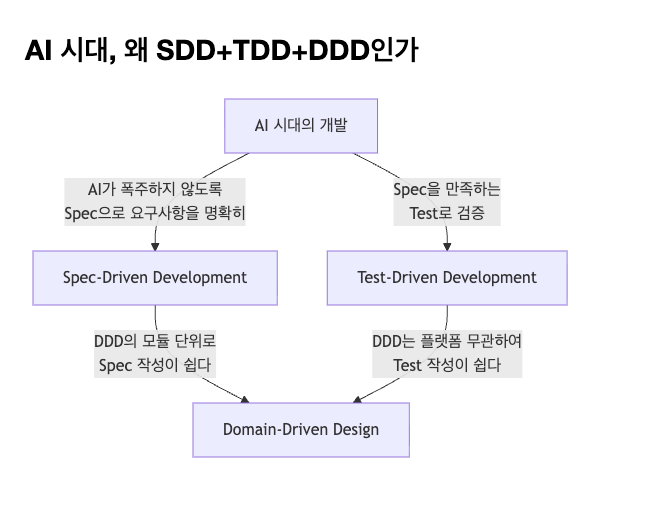

# AI 시대의 소프트웨어 엔지니어링
AI 효과를 극대화하는 SDD,TDD,DDD로 만드는 견고한 소프트웨어

황태근 | 010-9530-5974 | tkhwang.dev@gmail.com

## 목차 

### Part 1 — SDD+TDD+DDD 입문

  작은 도입 예제로 왜 도메인 중심인가를 설명하고, DDD 이론을 두 편으로 나눈 뒤
  본편 도메인에서 top-down 설계, SDD, TDD를 체험한다.

  Ch.1  — 왜 프레임워크에서 도메인으로 가야 하는가 — 시리즈 소개, 전체 로드맵
  Ch.2  — 같은 요구사항, 다른 코드 — 데이터 vs 객체 비교
  Ch.3  — DDD란 무엇인가 (1) — 전략적 설계와 핵심 객체
  Ch.4  — DDD란 무엇인가 (2) — 저장과 협력 구조
  Ch.5  — 요구사항에서 PRD 정의하기 — 본편 도메인 소개, PRD 작성
  Ch.6  — PRD에서 도메인 객체 뽑아내기 — DDD top-down 설계 (BC → Aggregate → Entity → VO)
  Ch.7  — AI와 함께 Spec 정의하기 — 콘텐츠 도메인 Value Object SDD
  Ch.8  — Spec을 TDD로 구현하기 — 콘텐츠 도메인 Value Object TDD

### Part 2 — DDD Building Blocks 상세

  본편 도메인(Watchable)을 기준으로, Ch.6에서 잡은 상위 설계를 바탕으로
  각 Building Block을 한 챕터에서 개념 + SDD + TDD로 완결한다.

  Ch.9  — Value Object — 개념 심화 + SDD + TDD
  Ch.10 — Entity — 식별자, 생명주기, 상태 전이
  Ch.11 — Aggregate — 일관성 경계, Aggregate Root
  Ch.12 — Domain Service — 여러 객체에 걸친 규칙
  Ch.13 — Repository — DIP, 인터페이스 vs 구현 분리
  Ch.14 — Application Service — 유스케이스 조율
  Ch.15 — Mapper와 Domain Event — 모델 변환과 Aggregate 간 연결

### Part 3 — DDD 응용 및 고급 주제

  주제별 독립 에세이 형태로, 순서에 크게 구애받지 않는다.

  Ch.16 — 나의 DDD 적용 실패기 — 실패 경험과 교훈
  Ch.17 — 프론트엔드에서 DDD 활용법 — React/Next.js 환경
  Ch.18 — Hexagonal Architecture — Ports & Adapters, 도메인과 인프라 분리
  Ch.19 — Event Sourcing 및 CQRS — 이벤트 기반 아키텍처
  Ch.20 — Functional Programming과 DDD — FP 관점의 도메인 모델링
  Ch.21 — AI 시대의 DDD 운영법 — Spec sync, 테스트, 협업 운영
