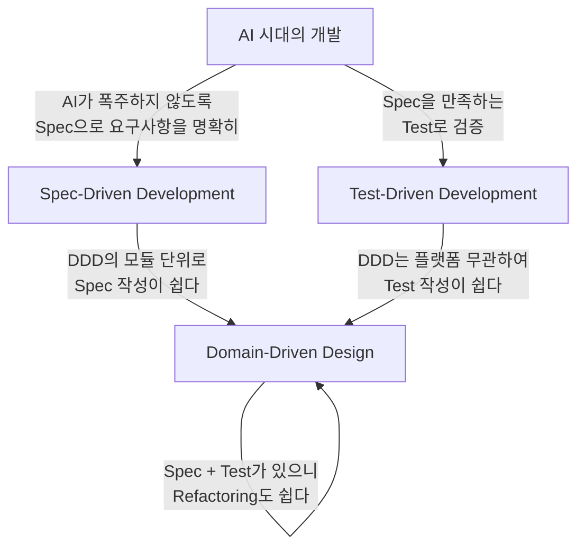

# SDD+TDD+DDD 시리즈 다이어그램

## AI 시대, 왜 SDD+TDD+DDD인가

```
요구사항 → PRD → 도메인 객체 → Spec → 테스트 목록 → 테스트 코드 → 구현 → 리팩토링
```


```mermaid
graph TD
    A["AI 시대의 개발"]
    B["Spec-Driven Development"]
    C["Test-Driven Development"]
    D["Domain-Driven Design"]

    A --> |"AI가 폭주하지 않도록\nSpec으로 요구사항을 명확히"| B
    A --> |"Spec을 만족하는\nTest로 검증"| C
    B --> |"DDD의 모듈 단위로\nSpec 작성이 쉽다"| D
    C --> |"DDD는 플랫폼 무관하여\nTest 작성이 쉽다"| D
    D --> |"Spec + Test가 있으니\nRefactoring도 쉽다"| D
```
